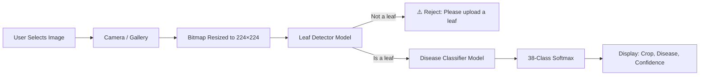

# 🌱 CropSense

<table align="center">
  <tr>
    <td align="center">
      
    </td>
    <td align="center">
      
    </td>
  </tr>
</table>

<p align="center">
  <strong>On-Device AI Crop Disease Detection — Works Fully Offline</strong>
</p>

<p align="center">
  
  
  
  
  
</p>

---

## 📖 Overview

**CropSense** is an Android application that runs **two TensorFlow Lite models entirely on-device** to help farmers and agricultural professionals identify crop diseases instantly — **no internet connection required**.

Simply capture or upload a photo of a crop leaf, and the app will:

1. 🍃 **Verify** whether the image is actually a leaf (binary leaf detector)
2. 🌾 **Identify** the crop type
3. 🦠 **Detect** the specific disease (or confirm the plant is healthy)
4. 📊 **Show** a confidence score for the prediction

Because inference happens locally with TFLite, results are fast, private (images never leave the device), and available in the field without connectivity.

---

## ✨ Key Features

| Feature | Description |
|---------|-------------|
| 📷 **Camera Capture** | Take a leaf photo directly within the app |
| 🖼️ **Gallery Upload** | Select an existing image from device storage |
| 🍃 **Two-Stage Inference** | A leaf-detector model gates the disease classifier — non-leaf images are rejected |
| 🔌 **Fully Offline** | Both TFLite models run on-device — no server, no API, no network needed |
| 🔒 **Private by Design** | Images are never uploaded or stored remotely |
| 📊 **Confidence Metrics** | Color-coded confidence bar (green / amber / red) |
| ⚠️ **Smart Warnings** | Low-confidence (<60%) prompts to retake; non-leaf images are flagged |
| ✅ **Healthy Detection** | Healthy plants are recognized and highlighted distinctly |
| 🎨 **Modern UI** | Clean, minimalist Jetpack Compose interface |
| 🌙 **Dark Mode** | Dark theme enabled by default |

---

## 🏗️ Tech Stack

### 📱 **Android**
- **Language:** Kotlin
- **UI Framework:** Jetpack Compose (Material 3)
- **Architecture:** MVVM (Model–View–ViewModel)
- **Image Loading:** Coil
- **Async Operations:** Kotlin Coroutines (`Dispatchers.IO` for inference)
- **Min SDK:** 28 (Android 9.0) · **Target SDK:** 36

### 🧠 **On-Device Machine Learning**
- **Runtime:** TensorFlow Lite 2.14.0 (+ TFLite Support 0.4.4)
- **Model 1 — Leaf Detector:** `plant_detector.tflite` — gates the pipeline by verifying the image is a leaf
- **Model 2 — Disease Classifier:** `model.tflite` — classifies the leaf across 38 crop/disease classes
- **Input:** 224×224 RGB, normalized to [0.0, 1.0] float32
- **Dataset:** PlantVillage (14 crops, 38 classes — see list below)

### 🌐 **Backend**
- **None.** CropSense is a fully offline, on-device application. No backend, no API calls.

---

## 🔄 How It Works



### Workflow Steps

1. **📸 Image Acquisition** — User captures a photo or picks one from the gallery.
2. **🗺️ Preprocessing** — The bitmap is decoded and resized to 224×224, then converted to a normalized float32 `ByteBuffer`.
3. **🍃 Leaf Detection** — `plant_detector.tflite` runs first. If the image isn't a leaf, analysis stops with a friendly warning.
4. **🦠 Disease Classification** — `model.tflite` runs on the same buffer and produces a 38-class softmax distribution.
5. **📊 Display** — The top class is parsed into crop + disease names, and the confidence is shown with a color-coded progress bar. Healthy plants get a distinct success card.

---

## 🌾 Supported Crops & Diseases

The disease classifier recognizes **38 classes** across **14 crops**:

<details>
<summary><strong>Tap to expand full class list</strong></summary>

| Crop | Conditions |
|------|-----------|
| 🍎 **Apple** | Apple scab, Black rot, Cedar apple rust, Healthy |
| 🫐 **Blueberry** | Healthy |
| 🍒 **Cherry** (incl. sour) | Powdery mildew, Healthy |
| 🌽 **Corn (maize)** | Cercospora/Gray leaf spot, Common rust, Northern Leaf Blight, Healthy |
| 🍇 **Grape** | Black rot, Esca (Black Measles), Leaf blight (Isariopsis Leaf Spot), Healthy |
| 🍊 **Orange** | Haunglongbing (Citrus greening) |
| 🍑 **Peach** | Bacterial spot, Healthy |
| 🫑 **Pepper (bell)** | Bacterial spot, Healthy |
| 🥔 **Potato** | Early blight, Late blight, Healthy |
| 🍇 **Raspberry** | Healthy |
| 🌱 **Soybean** | Healthy |
| 🎃 **Squash** | Powdery mildew |
| 🍓 **Strawberry** | Leaf scorch, Healthy |
| 🍅 **Tomato** | Bacterial spot, Early blight, Late blight, Leaf Mold, Septoria leaf spot, Spider mites, Target Spot, Yellow Leaf Curl Virus, Mosaic virus, Healthy |

</details>

---

## 🧪 Sample Predictions

| Crop | Disease | Confidence | Status |
|------|---------|------------|--------|
| Apple | Cedar Apple Rust | 99% | ✅ High Confidence |
| Tomato | Yellow Leaf Curl Virus | 94% | ✅ High Confidence |
| Potato | Early Blight | 87% | ✅ High Confidence |
| Corn | Common Rust | 54% | ⚠️ Low Confidence — retake advised |
| — | Not a leaf | — | 🚫 Rejected by leaf detector |

---

## 🚀 Getting Started

### Prerequisites
- Android Studio (Hedgehog or later recommended)
- Android SDK 36 (minimum API 28 / Android 9.0)
- Kotlin 1.9+
- **No internet connection required** to run or build the ML pipeline

### Installation

1. **Clone the repository**
   ```bash
   git clone https://github.com/thesatyam161/cropsense.git
   cd cropsense
   ```

2. **Open in Android Studio**
   - Open Android Studio → *Open an Existing Project* → select the cloned directory.

3. **Sync Gradle**
   - Let Android Studio sync and download dependencies.

4. **Run the App**
   - Connect an Android device (API 28+) or start an emulator.
   - Click **Run** ▶️ in Android Studio.

> ℹ️ The TFLite models (`plant_detector.tflite`, `model.tflite`) ship inside `app/src/main/assets/`, so the app is ready to classify out of the box — no download or configuration step.

---

## ⚙️ Configuration

The TFLite models are loaded from the `assets` folder and are **not compressed** in the APK (see `noCompress += "tflite"` in `app/build.gradle.kts`) so they can be memory-mapped at runtime.

### Key Gradle Dependencies

```kotlin
dependencies {
    // TensorFlow Lite — on-device inference
    implementation("org.tensorflow:tensorflow-lite:2.14.0")
    implementation("org.tensorflow:tensorflow-lite-support:0.4.4")

    // Jetpack Compose (Material 3)
    implementation(platform(libs.androidx.compose.bom))
    implementation("androidx.activity:activity-compose:1.8.2")
    implementation(libs.androidx.material3)
    implementation("androidx.compose.material:material-icons-extended:1.6.1")

    // Lifecycle / ViewModel
    implementation("androidx.lifecycle:lifecycle-viewmodel-compose:2.6.2")

    // Image loading
    implementation("io.coil-kt:coil-compose:2.5.0")
}
```

---

## 📱 App Architecture

```
com.example.cropsense
│
├── MainActivity.kt              # Compose UI: image preview, buttons, result cards
├── MainViewModel.kt             # State management; orchestrates on-device inference
│
├── ml/
│   └── DiseaseClassifier.kt     # Loads both TFLite models, runs 2-stage inference
│
├── model/
│   └── PredictionResponse.kt    # Result data model (crop, disease, confidence, is_leaf)
│
└── ui/
    └── theme/                    # Material 3 dark color scheme + typography
```

### Assets
```
app/src/main/assets/
├── plant_detector.tflite    # Stage 1 — leaf vs. not-leaf
└── model.tflite             # Stage 2 — 38-class disease classifier
```

---

## ⚠️ Important Notes

- **No Network Required:** All inference runs on-device via TensorFlow Lite. The app works fully offline.
- **Privacy:** Images are never uploaded — they are decoded in-memory and discarded after classification.
- **Two-Stage Safety:** The leaf detector rejects non-leaf images before the disease classifier runs, avoiding meaningless predictions.
- **Low Confidence:** Predictions below 60% confidence trigger a warning encouraging a clearer image.
- **Model Input:** Both models expect 224×224 RGB input normalized to `[0.0, 1.0]`.

---

## 🛠️ Future Roadmap

- [ ] **Top-3 Predictions** — show alternative diagnoses with confidence scores
- [ ] **Grad-CAM Visualization** — highlight image regions influencing the prediction
- [ ] **Prediction History** — local on-device storage of past analyses
- [ ] **Treatment Recommendations** — suggest remedies based on detected diseases
- [ ] **Multi-Language Support** — localization for farmers worldwide
- [ ] **Model Quantization** — reduce model size / speed up inference further
- [ ] **Batch/Scan Mode** — analyze multiple leaves in one session

---

## 🤝 Contributing

Contributions are welcome! Here's how to help:

1. Fork the repository
2. Create a feature branch (`git checkout -b feature/AmazingFeature`)
3. Commit your changes (`git commit -m 'Add some AmazingFeature'`)
4. Push to the branch (`git push origin feature/AmazingFeature`)
5. Open a Pull Request

---

## 📄 License

This project is licensed under the MIT License — see the [LICENSE](LICENSE) file for details.

---

## 🙏 Acknowledgments

- Dataset: [PlantVillage Dataset](https://github.com/spMohanty/PlantVillage-Dataset)
- ML runtime: [TensorFlow Lite](https://www.tensorflow.org/lite)
- Icons: Material Design Icons
- Inspiration: Supporting sustainable agriculture through accessible, offline-first technology

---

<p align="center">
  Made with ❤️ for farmers and agricultural professionals
</p>

<p align="center">
  ⭐ Star this repo if you find it helpful!
</p>
